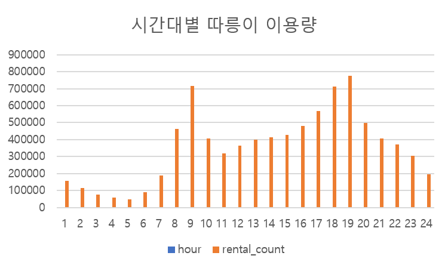
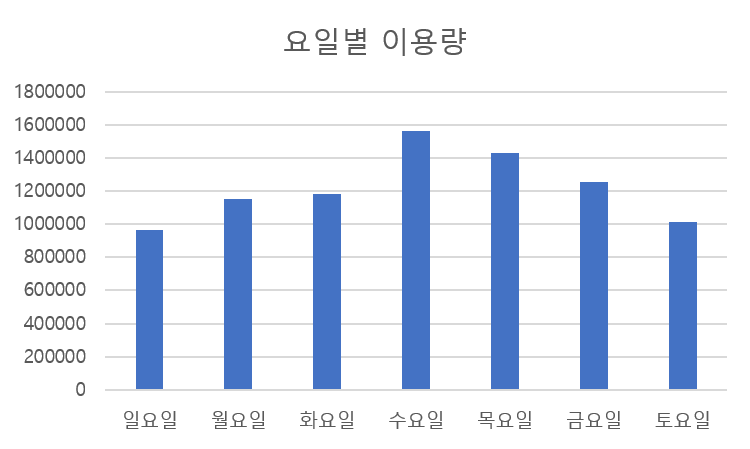
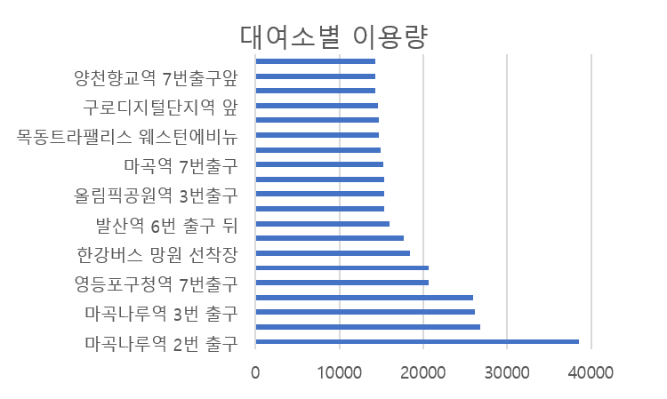
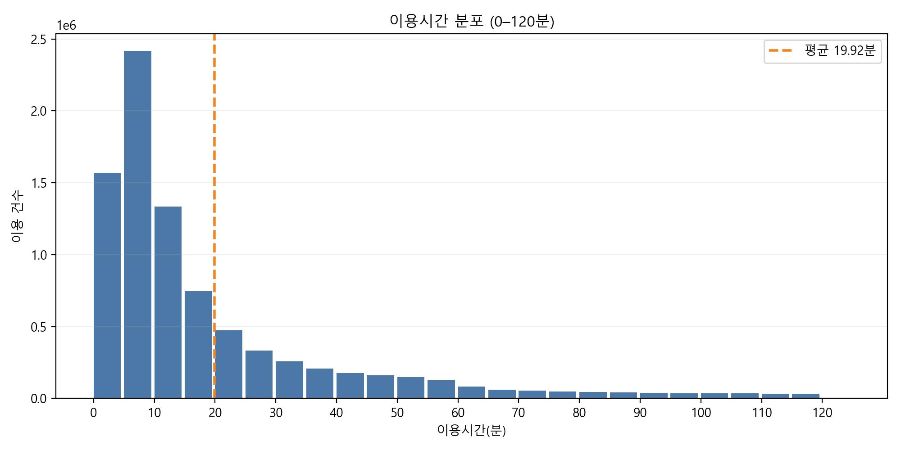

# seoul-bike-analysis
## 🚲 서울시 따릉이 운영 최적화 데이터 분석

## 📌 프로젝트 개요
서울시 공공자전거 서비스 따릉이의 대여 데이터를 분석하여
이용 패턴을 파악하고 운영 효율을 개선할 수 있는 인사이트를 도출하는 것을 목표로 한다.

따릉이는 출퇴근 시간대와 특정 지역에서 수요 집중 현상이 발생하며
대여소 간 자전거 불균형 문제가 발생할 수 있다.

본 프로젝트에서는 2025년 10월부터 12월까지 따릉이 대여 이력 데이터를 활용하여 이용 패턴을 분석하였다.

## 🎯 분석 목표
1. 시간대별 따릉이 이용 패턴 분석
2. 수요가 집중되는 대여소 파악
3. 대여소 간 이동 패턴 분석
4. 운영 최적화 전략 제안

## 📂 사용 데이터
- 데이터 출처: 서울 열린데이터 광장
- 사용 데이터: 서울시 공공자전거 대여이력 데이터
- 분석 기간: 2025-10부터 2025-12까지
- 데이터 규모: 총 약 8,559,939건
- 주요 컬럼: 자전거번호, 대여일시, 반납일시, 대여대여소명, 반납대여소명, 이용시간, 이용거리, 성별, 이용자종류, 생년

## 🧹 데이터 전처리
분석을 위해 다음과 같은 전처리를 수행하였다.

- 결측값 제거
- 시간대 변수 생성
- 요일 변수 생성
- 대여소 기준 집계 테이블 생성

예시 SQL

```sql
SELECT
  HOUR(start_time) AS hour,
  COUNT(*) AS rental_count
FROM bike_rental
GROUP BY HOUR(start_time)
ORDER BY hour;
```

## 📊 핵심 분석

### 1️⃣ 시간대별 수요 분석
#### 사용 SQL
```sql
SELECT
  strftime('%H', 대여일시) AS hour,
  COUNT(*) AS rental_count
FROM "서울특별시_공공자전거_대여이력_정보"
GROUP BY hour
ORDER BY rental_count;
```

시간대별 이용량을 분석한 결과 다음과 같은 패턴이 나타났다.



- 이용량이 가장 많은 시간: 18시 (777,254건), 08시 (715,908건), 17시 (710,764건)
- 이용량이 가장 적은 시간: 04시 (47,959건), 03시 (57,962건), 02시 (77,798건)
- **핵심 인사이트**: 따릉이는 출퇴근 시간대에 이용이 집중되는 패턴을 보였다. 특히 오전 8시, 오후 17-18시 구간에서 이용량이 가장 높았다. 이는 따릉이가 출퇴근 이동 수단으로 활용되는 경향이 높다는 것을 의미한다.

### 2️⃣ 요일별 이용 패턴
#### 사용 SQL
```sql
SELECT
  CASE strftime('%w', 대여일시)
    WHEN '0' THEN '일요일'
    WHEN '1' THEN '월요일'
    WHEN '2' THEN '화요일'
    WHEN '3' THEN '수요일'
    WHEN '4' THEN '목요일'
    WHEN '5' THEN '금요일'
    WHEN '6' THEN '토요일'
  END AS weekday,
  COUNT(*) AS rental_count
FROM "서울특별시_공공자전거_대여이력_정보"
GROUP BY strftime('%w', 대여일시)
ORDER BY strftime('%w', 대여일시);
```

요일별 이용량을 분석한 결과, 따릉이 이용은 평일과 주말에 서로 다른 패턴을 보였다.



- **평일(월-금)**에는 이용량이 상대적으로 높게 나타났으며 **주말(토-일)**에는 평일 대비 이용 패턴이 다소 완만하게 나타났다.
- **핵심 인사이트**: 이는 따릉이가 출퇴근 및 일상 이동 수단으로 활용되는 경향이 높다는 것을 의미한다. 또한 주말 이용은 여가 및 레저 활동 중심의 이용 패턴이 반영된 것으로 해석할 수 있다.

### 3️⃣ 대여소별 수요 분석
#### 사용 SQL
```sql
SELECT
  "대여 대여소명" AS station_name,
  COUNT(*) AS rental_count
FROM "서울특별시_공공자전거_대여이력_정보"
GROUP BY "대여 대여소명"
ORDER BY rental_count DESC
LIMIT 20;
```

대여소별 이용량을 분석한 결과, 특정 대여소에 이용 수요가 집중되는 패턴이 나타났다.



- 특히 지하철역 인근 대여소, 대형 업무지구 주변 대여소에서 높은 이용량이 확인되었다.
- **핵심 인사이트**: 이는 따릉이가 대중교통 연계 이동수단(Last-mile mobility)으로 활용되는 경향이 강하다는 것을 의미한다. 또한 유동인구가 많은 지역을 중심으로 대여 수요가 집중되는 특징을 확인할 수 있었다.

### 4️⃣ 이용 평균 시간 분석
#### 사용 SQL
```sql
SELECT
  ROUND(AVG("이용시간"), 2) AS "평균 이용시간(분)"
FROM "서울특별시_공공자전거_대여이력_정보"
WHERE "이용시간" IS NOT NULL;
```

DBeaver에서 실행한 결과 평균 이용시간은 19.92분으로 확인되었다. 이는 한 번의 대여가 약 20분 내외로 종료되는 경우가 많다는 의미이며, 자전거 회전율과 운영 효율을 평가하는 핵심 지표로 활용할 수 있다.



- **핵심 인사이트**: 시간대별 피크(08시, 17-18시), 평일 중심 이용, 지하철·업무지구 대여소 수요 집중이라는 1-3번 결과와 함께 보면 20분 내외의 단거리·환승형 이동이 주요 사용 시나리오임을 뒷받침한다. 따라서 평일에는 회전율과 재배치 효율을, 주말에는 여가성 이동을 고려한 공급 전략을 구분하는 것이 합리적이다.

### 5️⃣ 인기/부족 대여소 비교 및 재배치 필요 지역
#### 사용 SQL
```sql
-- 인기 대여소 (대여 기준)
SELECT
  "대여 대여소명" AS station_name,
  COUNT(*) AS rental_count
FROM "서울특별시_공공자전거_대여이력_정보"
GROUP BY "대여 대여소명"
ORDER BY rental_count DESC
LIMIT 10;
```

```sql
-- 대여-반납 수급 불균형 (순유출: 음수, 순유입: 양수)
WITH rentals AS (
  SELECT "대여 대여소명" AS station_name, COUNT(*) AS rental_count
  FROM "서울특별시_공공자전거_대여이력_정보"
  GROUP BY "대여 대여소명"
),
returns AS (
  SELECT "반납대여소명" AS station_name, COUNT(*) AS return_count
  FROM "서울특별시_공공자전거_대여이력_정보"
  GROUP BY "반납대여소명"
),
stations AS (
  SELECT station_name FROM rentals
  UNION
  SELECT station_name FROM returns
)
SELECT
  s.station_name,
  COALESCE(r.rental_count, 0) AS rental_count,
  COALESCE(t.return_count, 0) AS return_count,
  COALESCE(t.return_count, 0) - COALESCE(r.rental_count, 0) AS net_flow
FROM stations s
LEFT JOIN rentals r ON s.station_name = r.station_name
LEFT JOIN returns t ON s.station_name = t.station_name
ORDER BY net_flow ASC
LIMIT 10;
```

CSV 원본 데이터를 기준으로 인기/부족 대여소를 비교한 결과는 다음과 같다.

- **인기 대여소 상위(대여 기준)**: 마곡나루역 2번 출구(38,539건), 롯데월드타워(잠실역2번출구 쪽)(26,800건), 마곡나루역 3번 출구(26,155건), 마곡나루역 5번출구 뒤편(25,913건), 영등포구청역 7번출구(20,670건)
- **부족 대여소 상위(순유출)**: 신일해피트리아파트 앞(-2,397), 상왕십리역 1번출구(-2,378), 삼부르네상스파크빌(-2,234), 아차산역4번출구(-2,121), 서울시립대 정문 앞 B(-2,045)
- **공급 과잉 대여소 상위(순유입)**: 응암역2번출구 국민은행 앞(+3,607), 홍대입구역 2번출구 앞(+3,310), 창동역2번출구 하나은행365 앞(+2,222), 푸조비즈타워 앞(+2,099), 영등포역 1번출구(+2,029)

- **핵심 인사이트**: 순유출이 큰 대여소는 자전거가 빠르게 소진되는 구간으로 선제 배치가 필요하며, 순유입이 큰 대여소는 회수·분산 전략의 우선 대상이 된다. 이를 시간대별 피크와 결합하면 재배치 우선순위를 구체화할 수 있다.

## 🔍 주요 인사이트
1. 출퇴근 시간대 수요 집중
2. 역세권·업무지구 중심의 대여소 수요 집중
3. 평일 중심 이용, 주말은 완만한 패턴
4. 순유출/순유입 거점이 뚜렷해 재배치 우선순위 도출 가능

## 🚀 운영 개선 제안
1. 출퇴근 피크 이전 선제 재배치: 순유출 대여소를 중심으로 피크 시간 이전에 자전거를 우선 공급한다.
2. 순유입 거점 회수·분산: 순유입 대여소에서 자전거를 회수해 부족 대여소로 재배치한다.
3. 역세권·업무지구 상시 보급: 수요 집중 거점은 회전율 관리를 위해 상시 보급과 모니터링을 강화한다.
4. 주말 여가 수요 대응: 한강·상업권 등 주말 이용이 늘어나는 지역에 운영 리소스를 이동한다.

## ⚠️ 분석 한계
- 3개월 데이터만 사용하여 장기적인 계절성을 반영하지 못함
- 날씨, 강수량 등의 외부 요인을 고려하지 못함
- 대여소 위치 특성(상권, 지하철역 등)을 함께 분석하지 못함

## 🔎 향후 분석 계획
- 날씨 데이터를 결합한 이용 패턴 분석
- 대여소 위치 정보 기반 수요 분석
- 대여 → 반납 이동 경로 분석
- 수요 예측 모델 구축

## 📜 SQL 분석 코드
분석에 사용한 SQL 코드는 아래 파일에서 확인할 수 있다.

`sql/analysis_queries.sql`

## 🛠 사용 기술
- SQL (SQLite / DBeaver)
- Excel (데이터 시각화)
- GitHub (포트폴리오 관리)

## 📁 프로젝트 구조
```
seoul-bike-analysis
│
├ README.md
│
├ sql
│   └ analysis_queries.sql
│
├ images
│   ├ avg_duration.png
│   ├ hourly_usage.png
│   ├ station_usage.png
│   └ weekday_usage.png
│
└ report
```
